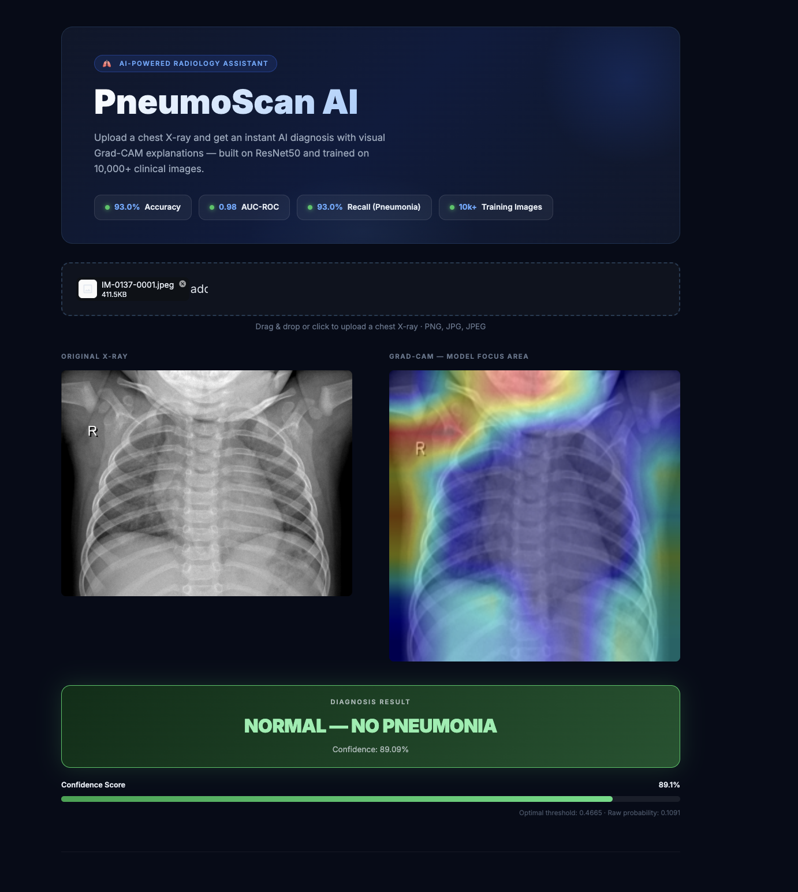
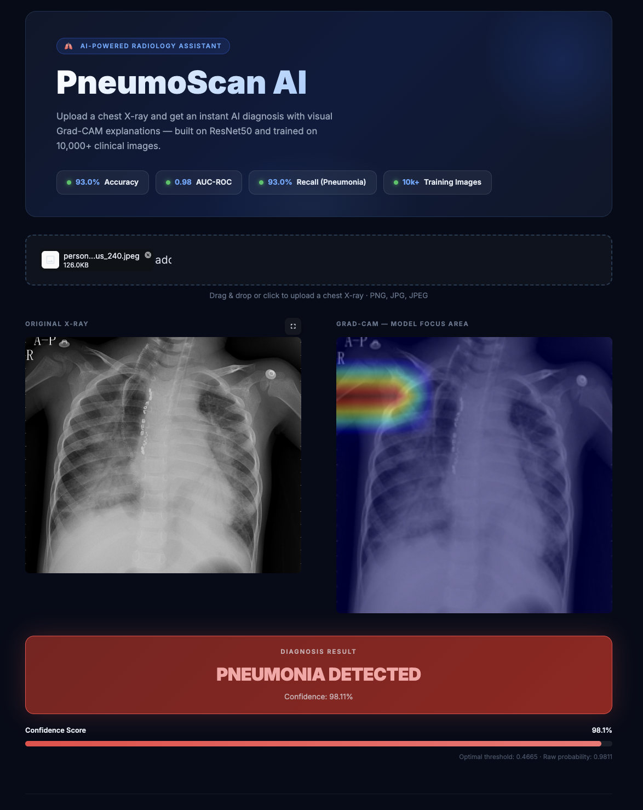
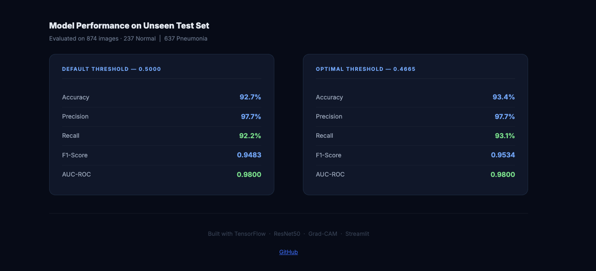
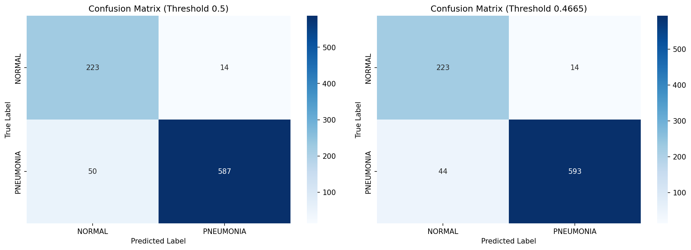
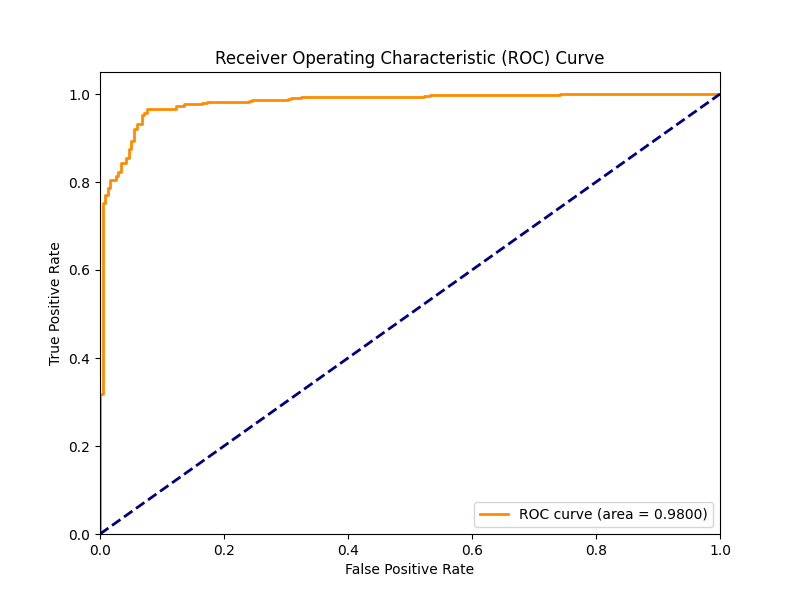
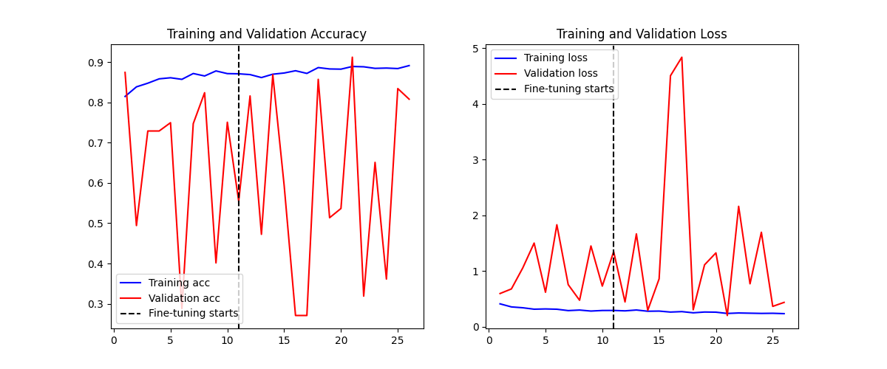
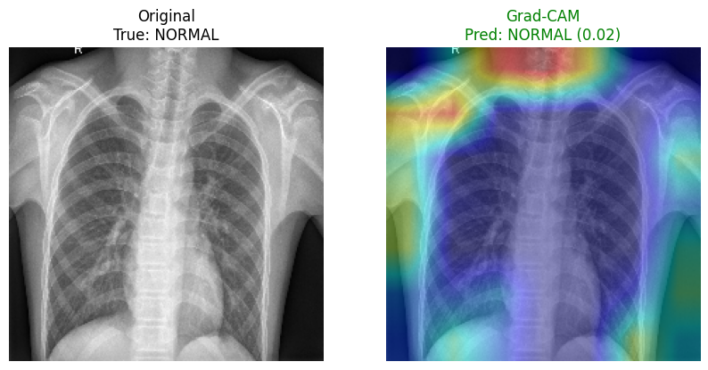
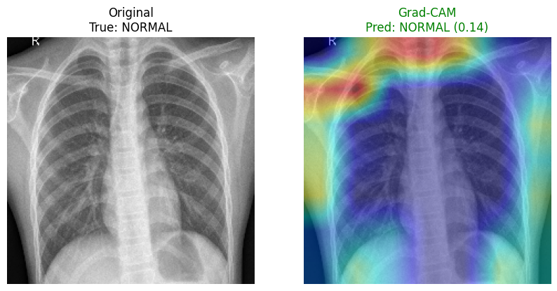
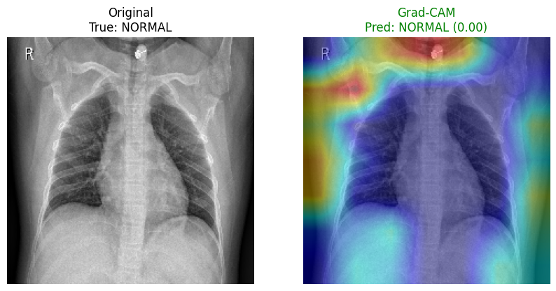

# 🩺 PneumoScan AI — Pneumonia Detection from Chest X-Ray

> **Empowering clinical decisions through Deep Learning and Grad-CAM transparency.**

[](https://www.python.org/)
[](https://www.tensorflow.org/)
[](https://streamlit.io/)
[](https://github.com/sandeepsahu1808/PneumoScan-AI-Pneumonia-Detection-from-Chest-X-Ray)

PneumoScan AI is a high-precision medical imaging assistant designed to detect pneumonia in chest X-rays. Built on the **ResNet50** architecture and fine-tuned for clinical reliability, it doesn't just provide a diagnosis—it provides **visual evidence** via **Grad-CAM (Gradient-weighted Class Activation Mapping)**, highlighting the specific lung regions that influenced the model's decision.

---

## 🚀 App Interface

Displaying the AI-powered dashboard featuring real-time inference and explainable heatmap visualizations.





---

## Sample Results

### Confusion Matrix — Default vs Optimal Threshold


### ROC Curve


### Training History


---

## Grad-CAM — Model Focus Area

Side-by-side comparisons of original X-ray (left) and Grad-CAM heatmap (right) showing which lung regions the model attends to when making predictions.





---

## Architecture

```
┌─────────────────────────────────┐
│   Streamlit Web App             │  ← localhost:8501
│   Upload X-Ray → Prediction     │
│   + Grad-CAM Heatmap            │
└──────────────┬──────────────────┘
               │
               ▼
┌─────────────────────────────────┐
│   Inference Pipeline            │
│   ┌───────────────────────────┐ │
│   │  ResNet50 (fine-tuned)    │ │
│   │  Threshold: 0.4665        │ │
│   │  Grad-CAM Visualization   │ │
│   └───────────────────────────┘ │
└──────────────┬──────────────────┘
               │
               ▼
┌─────────────────────────────────┐
│   Training Pipeline             │
│   Phase 1: Frozen base (15ep)   │
│   Phase 2: Fine-tune (20ep)     │
│   Class-weighted loss           │
└──────────────┬──────────────────┘
               │
               ▼
┌─────────────────────────────────┐
│   Dataset (Merged)              │
│   ~10,000 Chest X-Rays          │
│   70% Train / 15% Val / 15% Test│
└─────────────────────────────────┘
```

---

## Model Performance on Unseen Test Set

| Metric | Default (0.50) | Optimal (0.4665) |
|---|---|---|
| Accuracy | 92.7% | **93.4%** |
| Precision | 97.7% | **97.7%** |
| Recall (Pneumonia) | 92.2% | **93.1%** |
| F1-Score | 0.9483 | **0.9534** |
| AUC-ROC | 0.9800 | **0.9800** |

> Threshold optimized from 0.5 → 0.4665 to achieve ≥93% recall for pneumonia detection.  
> Medical priority: minimize false negatives (missed pneumonia cases).

---

## AI/ML Technologies Used

| Category | Technology | Purpose |
|---|---|---|
| Deep Learning | TensorFlow 2.21 / Keras | Model training and inference |
| Base Model | ResNet50 (ImageNet) | Transfer learning backbone |
| Computer Vision | OpenCV | Image preprocessing and Grad-CAM overlay |
| Explainability | Grad-CAM | CNN attention visualization on lung regions |
| Data Augmentation | Keras ImageDataGenerator | Rotation, zoom, flip, shear |
| Metrics | Scikit-learn | Evaluation metrics and threshold tuning |
| Deployment | Streamlit | Real-time web inference app |

---

## Techniques Used

| Technique | Implementation | Details |
|---|---|---|
| Transfer Learning | ResNet50 pretrained ImageNet | Frozen base → custom classification head |
| Fine-Tuning | Last 30 layers unfrozen | Phase 2 training with lr=1e-5 |
| Class Imbalance | `class_weight` in `model.fit` | PNEUMONIA ~2.7× more than NORMAL |
| Threshold Optimization | `precision_recall_curve` | Tuned 0.5 → 0.4665 for 93.1% recall |
| Grad-CAM | Gradient-weighted activation maps | Last conv layer: `conv5_block3_out` |
| Data Augmentation | Rotation ±15°, zoom 20%, h-flip | Applied to train set only |
| Early Stopping | patience=5 on `val_recall` | Best weights restored automatically |

---

## Dataset

| Source | Images | Link |
|---|---|---|
| Kaggle Chest X-Ray (Kermany) | ~5,856 | [paultimothymooney/chest-xray-pneumonia](https://www.kaggle.com/datasets/paultimothymooney/chest-xray-pneumonia) |
| Kaggle Augmented X-Ray | ~6,000 | [pcbreviglieri/pneumonia-xray-images](https://www.kaggle.com/datasets/pcbreviglieri/pneumonia-xray-images) |
| Total after merge + dedup | ~10,000 | — |

**Split:** 70% Train / 15% Validation / 15% Test (stratified, MD5 deduplication applied)

---

## Setup

### 1. Clone & Install
```bash
git clone <repo-url>
cd pneumoscan-ai
pip install -r requirements.txt
```

### 2. Dataset
- Download Dataset 1: [kaggle.com/datasets/paultimothymooney/chest-xray-pneumonia](https://www.kaggle.com/datasets/paultimothymooney/chest-xray-pneumonia)
- Download Dataset 2: [kaggle.com/datasets/pcbreviglieri/pneumonia-xray-images](https://www.kaggle.com/datasets/pcbreviglieri/pneumonia-xray-images)
- Place in `data/chest_xray_1/` and `data/chest_xray_2/`

```bash
python src/merge_datasets.py
python src/resplit_dataset.py
```

### 3. Train
```bash
python src/train.py
```

### 4. Evaluate
```bash
python src/evaluate.py
```

### 5. Run Grad-CAM
```bash
python src/gradcam.py
```

### 6. Run App
```bash
# Use your project virtual environment
venv/bin/streamlit run app.py
```

---

## Project Structure

```
pneumoscan-ai/
│
├── app.py                        # Streamlit inference web app
├── requirements.txt              # Python dependencies
├── README.md
│
├── src/
│   ├── data_pipeline.py          # ImageDataGenerator + class weights
│   ├── merge_datasets.py         # MD5 dedup + dataset merging
│   ├── resplit_dataset.py        # Stratified 70/15/15 split
│   ├── model.py                  # ResNet50 model definition
│   ├── train.py                  # Two-phase training pipeline
│   ├── evaluate.py               # Metrics, threshold tuning, ROC, CM
│   └── gradcam.py                # Grad-CAM heatmap generation
│
├── data/
│   ├── chest_xray_1/             # Kaggle Dataset 1 (raw)
│   ├── chest_xray_2/             # Kaggle Dataset 2 (raw)
│   └── merged/
│       ├── train/
│       │   ├── NORMAL/
│       │   └── PNEUMONIA/
│       ├── val/
│       │   ├── NORMAL/
│       │   └── PNEUMONIA/
│       └── test/
│           ├── NORMAL/
│           └── PNEUMONIA/
│
├── models/
│   └── best_model.h5             # Best fine-tuned ResNet50 weights
│
└── results/
    ├── confusion_matrix_comparison.png
    ├── roc_curve.png
    ├── training_history.png
    ├── metrics.json
    ├── model_summary.txt
    ├── training_log_phase1.csv
    ├── training_log_phase2.csv
    └── gradcam/
        └── sample_*.png          # Grad-CAM overlay samples
```

---

## Limitations

- Trained on 2 Kaggle datasets (~10,000 images) — not clinical data
- Binary classification only: Normal vs Pneumonia
- Not validated on real hospital data — for educational use only
- Best results on adult chest X-rays (pediatric performance may vary)

---

## Disclaimer

> ⚠️ This project is for educational and research purposes only.  
> Not intended for clinical diagnosis or medical use.  
> Always consult a qualified medical professional.

---

## License

MIT License
